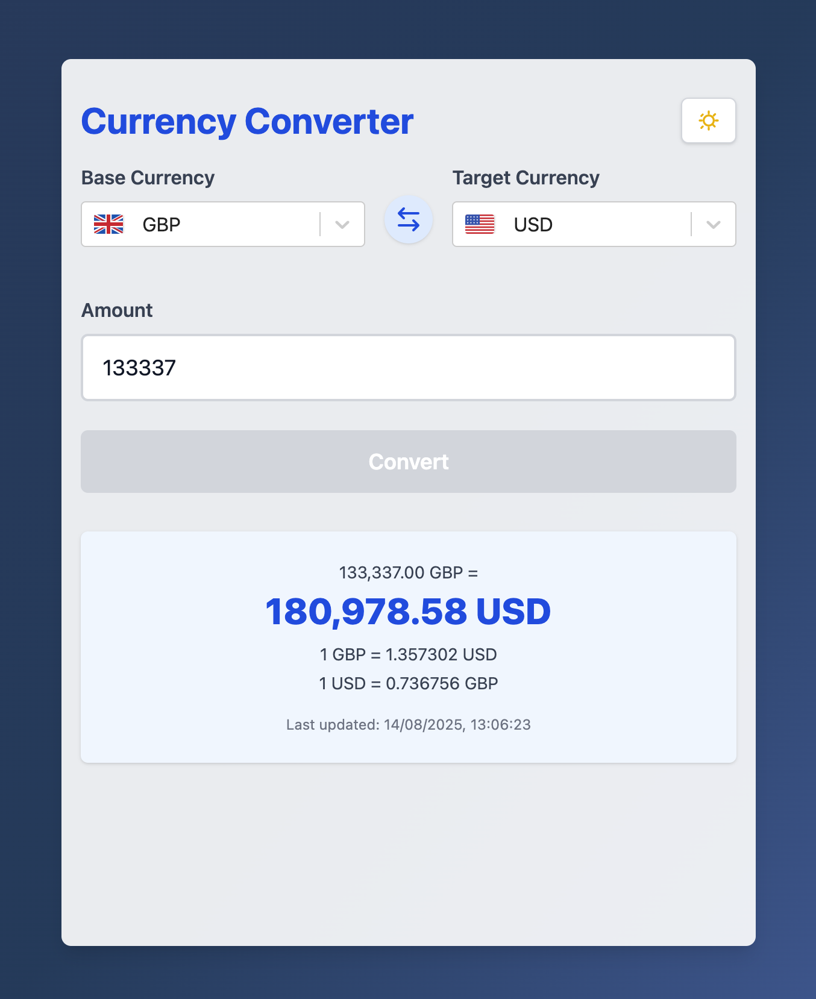

# Currency Converter

Instantly convert currencies using up-to-date exchange rates from [floatrates](http://floatrates.com)



## Features
- Select base and target currencies (with flags from country-flag-icons 🇬🇧)
- Enter an amount (max 2 decimals)
- See conversion result, rounded to 2 decimals
- Cache prevents repeated API calls within a short time
- Responsive, accessible UI (Tailwind CSS v4)
- Validation and error handling
- Redux for state management
- Unit and integration tests (Vitest + React Testing Library)

## Setup
1. Install dependencies:
  ```sh
  npm install
  ```
2. Start the dev server:
  ```sh
  npm run dev
  ```

## Usage
- Select currencies and enter an amount
- Click Convert to see the result
- Continue typing to see the result update in real-time
- Errors and loading states are clearly indicated

## Testing
Run all tests:
```sh
npm test
```
Unit tests are in `src/__tests__`. Integration test is in `src/App.test.tsx`.

## Approach & Decisions

### State Management
- **Redux Toolkit** is used for global state, handling base/target currencies, amount, conversion result, exchange rates, loading/error states, and caching.
- **Async Thunk** fetches rates from [floatrates](http://floatrates.com), with caching to minimize API calls.

### Component Structure
- **Modular components**:
  - `CurrencyDropdown`: Currency selection with flags (using country-flag-icons).
  - `AmountInput`: Validated input for amounts.
  - `ConvertButton`: Triggers conversion.
  - `ResultDisplay`: Shows conversion result and rates.
  - `ErrorMessage`: Displays errors.
  - `ThemeToggle`: Light/dark mode toggle.
- **App** orchestrates state, validation, and component interactions.

### Validation
- **Amount input**: Only positive numbers, max 2 decimals, upper limit enforced.
- **Error handling**: Immediate feedback for invalid input and API errors.

### Testing
- **Unit tests** for all components (`AmountInput`, `ConvertButton`, `ErrorMessage`, `ResultDisplay`).
- **Integration test** for the full conversion flow in `App.test.tsx`.
- **React Testing Library + Vitest** for robust, maintainable tests.

### Styling & UX
- **Tailwind CSS v4** for responsive, accessible, modern UI.
- **Dark mode**: User/system preference, toggleable.
- **Currency selection**: Flags for clarity, custom dropdown styling.
- **Mobile-first design**: Layout adapts for desktop and mobile.
- **Loading and error states**: Clearly indicated.
- **Real-time updates**: Conversion result updates as you type.

### UX Research
- Compared with other currency converters to ensure:
  - **Simple, uncluttered interface**.
  - **Fast, real-time feedback**.
  - **Accessible controls** for both desktop and mobile users.